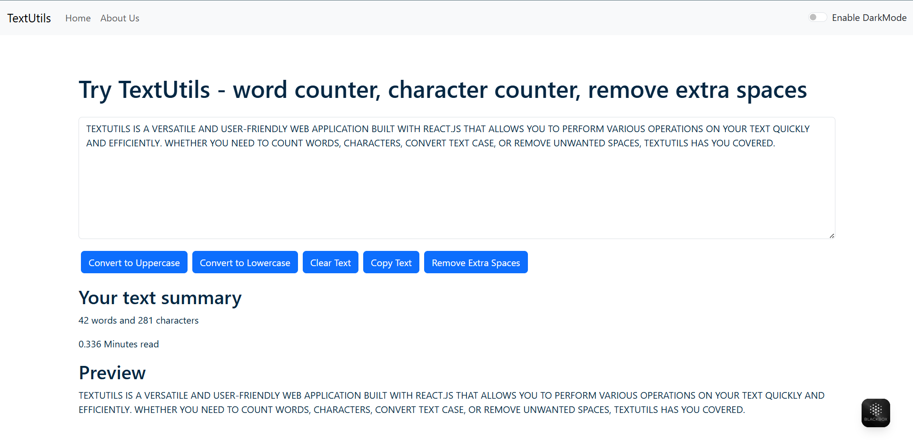
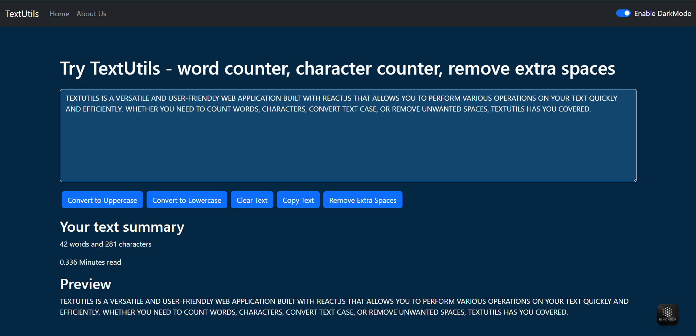

# TextUtils - React Text Utility Application




## Overview

TextUtils is a versatile and user-friendly web application built with React.js that allows you to perform various operations on your text quickly and efficiently. Whether you need to count words, characters, convert text case, or remove unwanted spaces, TextUtils has you covered.

## Features

* **Word Counter:** Get an instant count of words in your text.
* **Character Counter:** See the total number of characters (including spaces).
* **Case Conversion:**
    * Convert text to `UPPERCASE`.
    * Convert text to `lowercase`.
* **Clear Text:** Easily clear all text from the input area.
* **Copy Text:** Copy the manipulated text to your clipboard with a single click.
* **Remove Extra Spaces:** Clean up your text by removing redundant spaces.
* **Reading Time Estimation:** Get an estimate of how long it would take to read your text.
* **Live Preview:** See a real-time preview of your text as you type.
* **Dark Mode Toggle:** Switch between light and dark themes for a comfortable viewing experience.
* **Alert Notifications:** Receive instant feedback for actions performed (e.g., "Copied to Clipboard!", "Dark mode enabled").
* **Responsive Design:** Optimized for various screen sizes (thanks to Bootstrap 5).
* **About Page:** Learn more about the application and its functionalities.

## Technologies Used

* **React.js:** Frontend JavaScript library for building user interfaces.
* **React Router DOM:** For declarative routing within the application.
* **Bootstrap 5:** CSS framework for responsive and modern UI components.
* **JavaScript (ES6+)**
* **HTML5**
* **CSS3**

## Installation and Setup

To run this project locally, follow these steps:

1.  **Clone the repository:**
    ```bash
    git clone [https://github.com/ankitkumarsinha6/react-textutils-app.git]
    ```
2.  **Navigate to the project directory:**
    ```bash
    cd react-textutils-app
    ```
3.  **Install dependencies:**
    ```bash
    npm install
    # OR
    yarn install
    ```
4.  **Start the development server:**
    ```bash
    npm start
    # OR
    yarn start
    ```
    This will open the application in your default browser at `http://localhost:3000`.

## Usage

1.  Type or paste your text into the main text area on the homepage.
2.  Use the buttons below the text area to perform various text manipulations (e.g., "Convert to Uppercase", "Remove Extra Spaces").
3.  Observe the word count, character count, and reading time in the summary section.
4.  Use the toggle switch in the Navbar to switch between Light and Dark modes.
5.  Navigate to the "About Us" page using the Navbar link to learn more.


*(Replace this with an actual screenshot of your TextUtils in dark mode)*

## Project Structure

react-textutils-app/
├── public/                 # Static assets (index.html, favicon, manifest)
├── src/
│   ├── components/         # Reusable React components
│   │   ├── About.js
│   │   ├── Alert.js
│   │   ├── Navbar.js
│   │   └── Textform.js
│   ├── App.css             # Global CSS for App component
│   ├── App.js              # Main application component, handles routing and state
│   ├── index.css           # Global CSS for the entire app
│   ├── index.js            # React app entry point
│   └── reportWebVitals.js  # Web Vitals reporting
├── .gitignore              # Specifies intentionally untracked files to ignore
├── package.json            # Project metadata and dependencies
├── README.md               # This file
└── yarn.lock               # (or package-lock.json) Dependency lock file


## Contributing

Feel free to fork this repository, make improvements, and submit pull requests. Any contributions are welcome!

## License

This project is open source and available under the [MIT License](LICENSE).

---
